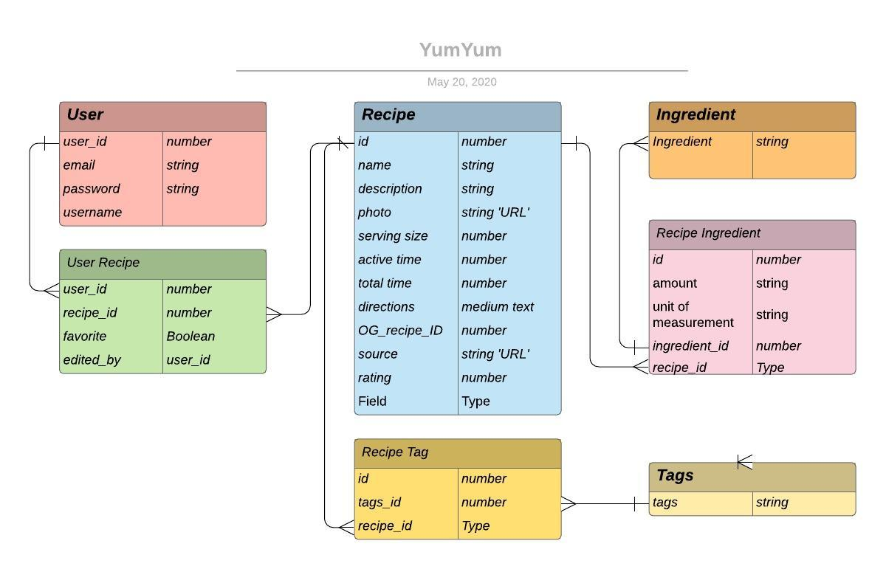

 

# Yum&Yum
(yum-ē-yum) is your favorite Recipe Manager.  Create, Save, View, and Edit your recipes -- You can do it all.  Our application does not handle users passwords, instead, Google Firebase manages authentication. Once the user logs in, the app registers the user and sets the user to GlobalState enabling the user to move between pages, Search Recipes, Favorite Recipes, Add Recipes, Copy Recipes, Edit Recipes and display each of the directions in a prominent modal for easy viewing on any device.

Yum&Yum is a MERN (MySql - Express - React - Node) application designed, developed, & deployed in less than two weeks by the team of 3 people utilizing Agile methodolgies.  The application uses MySql -- taking advantage of the 7 tables, 7 joins with 3 many to many relationships.  The front end is built in React and uses hooks across 8 pages utilizing 7 additional components shared with the pages.  GlobalState enables user engagement and favorite tracking with all the recipes. 

In less than two weeks, the team of 3 decided on a project, identified Minimum Viable Product (MVP), created pages of Epic Stories, Use Cases and competitive research to determine a viable product.

## Site Images


## Table of Contents
- [Technologies Used](#Technologies-Used)
- [Learning Points](#Learning-Points)
- [Installation](#Installation)
- [Acknowledgements](#Acknoledgements)
- [Authors](#Authors)

## Technologies Used
-  **React** - models and renders how the information displays in the browser.
-  **Sequelize** - used to model, store and retrieve data
-  **MySQL** - used to track application details
-  **Authentication** - used to authentication users upon login
-  **Storage** - used to store recipe images uploaded by the user.
- **React Bootstrap** - provides preset CSS styles 
- **Git** - version control system for tracking changes to code
- **Github** - to host the repository
- **Axios** - Promise based client for node.js
-  **Heroku** - to host the deployed site
- **Express** - minimal and flexible web application framework
- **Nodejs** - JavaScript runtime built on Chrome's V8 JavaScript engine
- **JavaScript** - JavaScript is a prototype-based object-oriented program language 

​
## Learning Points
### React
Utilizing React Routes the App.js file routes to the pages that utilize components keeping the code DRY.
```
    <Router>
      <div>
        <SessionProvider>
        {/* <UserProvider> */}
          <MainDiv>
            <NavTabs />
            <Switch>
            <Route exact path="/" component={Home} />
            <Route exact path="/search" component={Search} />
            <Route exact path="/myRecipes" component={MyRecipes} />
            <Route exact path="/profile" component={Profile} />
            <Route exact path="/login" component={Login} />
            <Route exact path="/signup" component={Signup} />
            <Route exact path="/add-recipe" component={AddRecipe} />
            <Route exact path="/recipes/:id" component={Details} />
            <Route exact path="/seedsPage" component={seedsPage} />
            <Route component={NoMatch} />
            </Switch>
          </MainDiv>
        {/* </UserProvider> */}
        </SessionProvider>
      </div>
    </Router>
```

When SEARCH and MY RECIPES render the recipe cards on the page, the pages share the CARD component to render the database query results for the recipe images, title and favorite.  The CARD utilizes GlobalState to access the UserId and manage Favortites. 
```
    const updateFavorite = (id) => {
        setFavorite(!favorite);
        console.log(`changeFavorite(${id})`);
        
        let tempFavs = { ...state.favorites };
        tempFavs[id] = favorite;
        dispatch({
            type: UPDATE_FAVORITE,
            favorites: tempFavs
        });

        const chgUserRecipeFav = {
            RecipeId: id,
            UserId: state.user.id,
            userRecipeKey: `${state.user.id}-${id}`,
            favorite: favorite
        };

        API.updateUserRecipe(chgUserRecipeFav)
            .then(favUpdated => {
                console.log(favUpdated);
            })
    };
```
On the Details page, the app uses GlobalState to determine if the recipe is owned by the user for editing purposes. If a recipe is owned by the user, the recipe can be added. Otherwise, it can be copied.
```
        data.UserRecipes.map(item => {
            item.UserId === state.user.id && item.edited === true ?
            owner = true
            setOwnedByUser(true) :
            owner = false
            setOwnedByUser(false);
            
```


### Sequelize and MySQL


To manage the routes we modularized the routes by their API reference in the routes/api/index.js file
```
// routes/api/index.js

// User routes
router.use("/user", userRoutes);

// User Recipe routes
router.use("/userRecipe", userRecipeRoutes);

// Recipe routes
router.use("/recipe", recipeRoutes);

// Search routes
router.use("/search", searchRoutes);

// Ingredient routes
router.use("/ingredient", ingredientRoutes);

// recipeIngredient routes
router.use("/recipeIngredient", recipeIngredientRoutes);
```
Multiple routes reference the same database controller because it access the same table.
```
// search.js
router
    .route("/:search")
    .get(recipeController.search);
```
```
// recipe.js
  .route("/")
  .get(recipeController.findAll)
  .post(recipeController.create)
  .put(recipeController.update)

//matches with "/api/recipe/all/top"
router
  .route("/all/top")
  .get(recipeController.findTop25)

// Matches with "/api/recipe/one/:recipeId"
router
  .route("/one/:recipeId")
  .get(recipeController.findOne)
  // .put(recipeController.update)
  .delete(recipeController.delete);
```
### Firebae Authentication and Storage
The app uses Firebase authentication to remove the need to maintain user passwords keeping user private information on the client.  When Firebase responds with authentication, the App registers the user with Yum&Yum to set GlobalState for the User, User Favorites.

Firebase storage is used to enable the user to load their own images for the APP to use for each of the user's recipes.
```
async function fileUpload() {
        setLoaded(false);
        // create a reference to the file we selected through input
        var storageRef = storage.ref("images/" + file.name)
        // adds the file to firebase and returns a status
        storageRef.put(file).then((snapshot) => {
            // with the response location, we can get the download URL
            storage.ref(snapshot.ref.location.path).getDownloadURL().then(function (url) {
                // we set the value of the URL response as the value of the image
                setRecipe({ ...getRecipe, photo: url })
                setLoaded(true);
            }).catch(err => console.log(err));
        })}
```
## Installation 
### Dependencies
* GitHub repository
* Nodejs
* React
* MySQL

### Directions
1. Fork the repository   
2. Clone your repository
3. Open a terminal and cd into your cloned repo
4. "cd app"
5. "npm install" // install the node modules
6. "cd yumyum"
7. "npm install" // ensure all node modules are installed for React
8. "cd .." // you should be back in ./app
9. "mysql -u root -p" // enter your password at the prompt
10. "CREATE DATABASE yumyum"
11. "/q" or CTRL-Z to quit
12. "npm run start" // starts your server, creates your database tables, starts react and opens a browser.

## Acknowledgements
Barefoot Contessa, Ina Garten, provided the seeder recipes for examples.

## Authors
If you have any questions about the repository, feel free to contact the authors on Githhub:

   [GitHub](https://github.com/analoo) Ana Medrano  
  
   [GitHub](https://github.com/PopSizzle) Sam Poppe   

   [GitHub](https://github.com/chindowns) Michael Downs 
